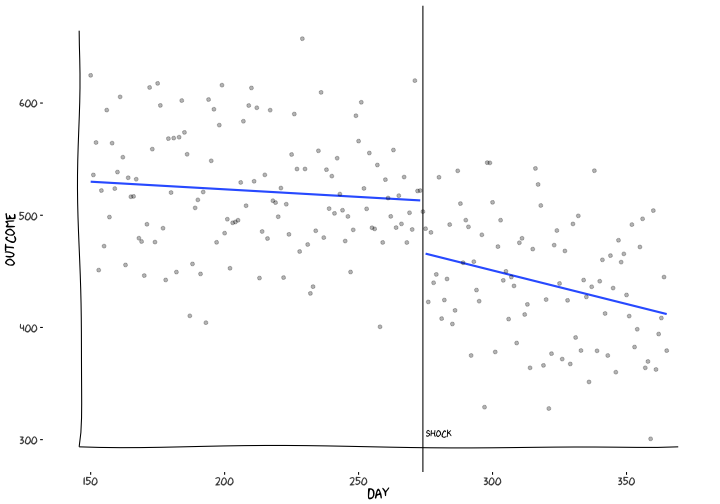
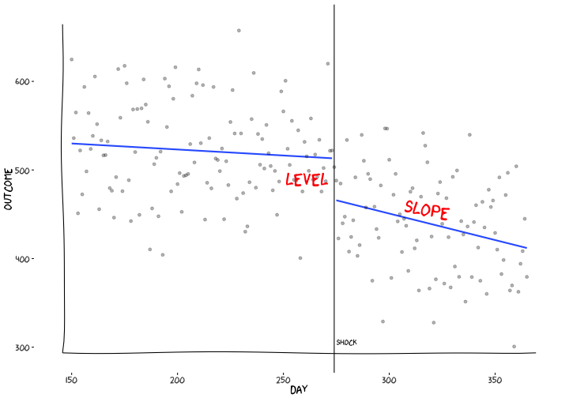
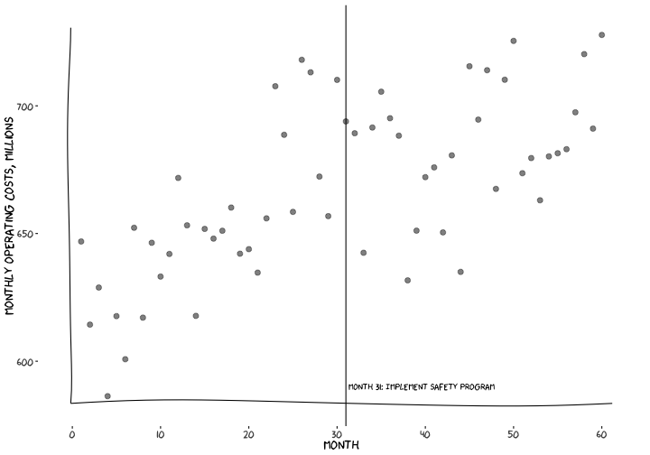
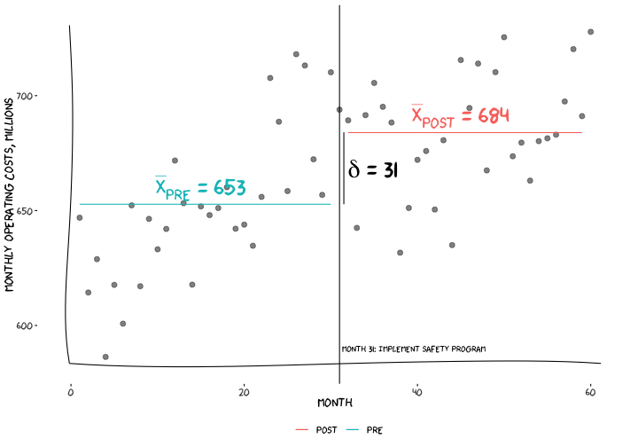
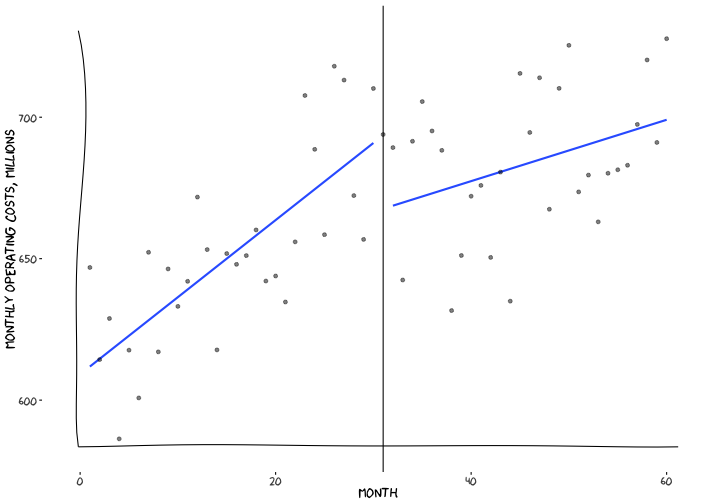
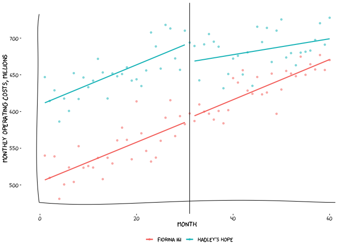

Modeling policy interventions
========================================================
author: Kyle D Hart
date: 18 November 2020
autosize: true
css: gfx/styles.css


Agenda
========================================================

* Intro
* Some stuff
* Outro

Panel data 
========================================================


Panel data
========================================================



Building Better Worlds | The Weyland-Yutani workplace safety program
========================================================

* Terraforming workers at the Hadley's Hope colony on exomoon LV-426 sometimes experience serious workplace injuries. 
* These injuries can lead to expensive claims against the company and delays in the colonization schedule. 
* On October 1, 2176, the Weyland-Yutani corporation implemented a safety program that included a mandatory 3-hour training workshop and disciplinary measures for workers who don't follow safety protocols. 


Research question
========================================================

> What effect does this policy intervention have on monthly operating costs?  

Some strategies
========================================================

Increasing level of sophistication:

* Pre/post test
* Interrupted time series (ITS)
* Comparative ITS
* Difference in differences

Pre/post
========================================================




Pre/post
========================================================


Pre/post
========================================================
$$
t = \frac{\bar{X}_{post} - \bar{X}_{pre}}{s \sqrt{\frac{2}{n}}}
$$


```r
with(hadleys_hope, t.test(y ~ post))
```

```

	Welch Two Sample t-test

data:  y by post
t = -4.1092, df = 56.472, p-value = 0.0001297
alternative hypothesis: true difference in means is not equal to 0
95 percent confidence interval:
 -46.35490 -15.97469
sample estimates:
mean in group FALSE  mean in group TRUE 
           652.7475            683.9123 
```

Pre/post
========================================================

Equivalently, 
$$
Y = \beta_0 + \beta_1 \times POST + \mathbf{\beta_x X} + \varepsilon
$$

```r
summary(lm(y ~ post,
           data=hadleys_hope))
```

```

Call:
lm(formula = y ~ post, data = hadleys_hope)

Residuals:
    Min      1Q  Median      3Q     Max 
-66.427 -16.844  -1.301  14.914  65.270 

Coefficients:
            Estimate Std. Error t value Pr(>|t|)    
(Intercept)  652.747      5.314 122.834  < 2e-16 ***
postTRUE      31.165      7.644   4.077 0.000141 ***
---
Signif. codes:  0 '***' 0.001 '**' 0.01 '*' 0.05 '.' 0.1 ' ' 1

Residual standard error: 29.59 on 58 degrees of freedom
Multiple R-squared:  0.2228,	Adjusted R-squared:  0.2094 
F-statistic: 16.62 on 1 and 58 DF,  p-value: 0.0001406
```


========================================================



Pre-post 
========================================================

ITS 
========================================================


CITS 
========================================================




Diff-in-Diff
========================================================

Some econometrics
========================================================

Fixed effects 
========================================================

Clustered standard errors 
========================================================

Marginal effects 
========================================================

Propensity scores 
========================================================
 
How to speak to an economist
========================================================

Endogeneity 
========================================================

Indicators 
========================================================

Others? 
========================================================

