<style>
.forceBreak { -webkit-column-break-after: always; break-after: column; }
</style>


# Intro

## Agenda

* Intro
* One-sample methods:
  - Pre/post means
  - Interrupted time series
* Two-sample methods: 
  - Treatment/comparison means
  - Comparative interrupted time series
  - Difference in differences
* Regression methods
  - Fixed effects
  - Linear probabilty models


<div class="notes">
This is my *note*.
- It can contain markdown
- like this list
</div>

## About me, about this talk

* Not an authority
* Been thinking about this stuff
* It's been weird having a biostats background and then jumping in with all these economist-types.
* They probably assumed I was 100% on board with all this econometrics stuff when they asked me to do this HAHAHAAHAa

## Estimate, estimator, estimand

* I tried to frame this similar to https://diff.healthpolicydatascience.org/. You should read that if you haven't already. 
* For each approach, think about the estimand you are trying to estimate.

## Notation

$$
\begin{align}
  Y(t) ~~&|~~  \mbox{Observed outcome at time } t \\
  D = 0 ~~&|~~ \mbox{Control} \\
  D = 1 ~~&|~~ \mbox{Treated} \\
  t = 1, \ldots, T_0 ~~&|~~ \mbox{Pre-intervention times} \\
  t = T_0 + 1, \ldots, T ~~&|~~ \mbox{Post-intervention times} \\
  Y^d(t) ~~&|~~ \mbox{Potential outcome with treatment } D=d \mbox{ at time } t
\end{align}
$$
<!-- X ~~&|~~ \mbox{Observed covariates} \\ -->
<!--   U ~~&|~~ \mbox{Unobserved covariates} -->

## Counterfactual framework

**Two parallel universes** {width=30%, height=30%, align=right}

* one where the intervention occurred 
* one where the intervention did not occur

<br><br>

Policy effect = difference between the outcomes in those two universes

## Average treatment effect on the treated (ATT)

**Estimand:**
$$
\begin{align}
ATT =& E[Y^1 - Y^0 | D = 1] \\
    =& E[Y^1 | D = 1] - E[Y^0 | D = 1]
\end{align}
$$


**Estimator:**

$$
\begin{align}
ATT &\approx E[Y^1 | D = 1] - \mbox{(some surrogate for } E[Y^0 | D = 1])
\end{align}
$$


# Application: Terraforming LV-426

## Hadley's Hope


## Building Better Worlds | The Weyland-Yutani workplace safety program

* Terraforming workers at the Hadley's Hope colony on exomoon LV-426 sometimes experience serious workplace injuries. 
* These injuries can lead to expensive claims against the company and delays in the colonization schedule. 
* On October 1, 2176, the Weyland-Yutani corporation implemented a safety program that included a mandatory 3-hour training workshop and disciplinary measures for workers who don't follow safety protocols. 

## Data


```
## # A tibble: 6 × 8
##   colony         time     t colony_effect weather_index treat  post     y
##   <chr>         <int> <int>         <dbl>         <dbl> <dbl> <dbl> <dbl>
## 1 Hadley's Hope     1   -30         -10.4          3.48     1     0  516.
## 2 Hadley's Hope     2   -29         -10.4          3.79     1     0  533.
## 3 Hadley's Hope     3   -28         -10.4          3.36     1     0  556.
## 4 Hadley's Hope     4   -27         -10.4          6.25     1     0  548.
## 5 Hadley's Hope     5   -26         -10.4          8.69     1     0  575.
## 6 Hadley's Hope     6   -25         -10.4          7.94     1     0  578.
```

## Broad research question

> What effect does this policy intervention have on monthly operating costs?  

## Some strategies

* Pre/post test
* Interrupted time series (ITS)
* Comparative ITS
* Difference in differences


# Comparing pre/post means

## Operating costs over time: <span style="color:red">Panel data</span>

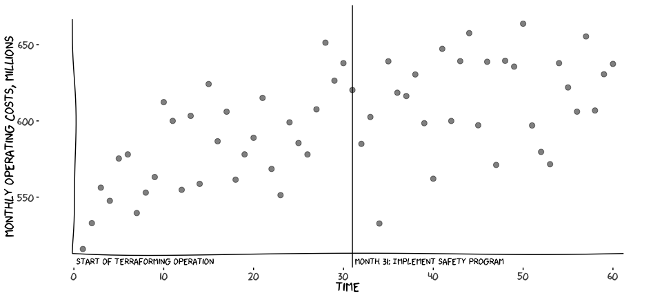<!-- -->


## Compare means

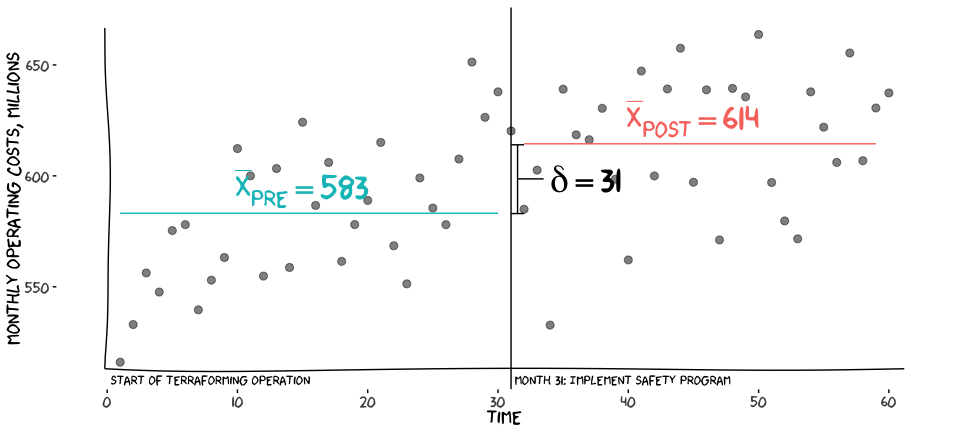<!-- -->

## ATT

$$
\begin{align}
ATT =& E[Y^1 - Y^0 | D = 1] \\
    =& E[Y^1 | D = 1] - E[Y^0 | D = 1]
\end{align}
$$
$E[Y^0 | D = 1]$ is in the other universe, so assume 

$$
\begin{align}
E[Y^0 | D = 1] &\approx E[Y^1(t \le T_0) | D = 1]
\end{align}
$$

## Counterfactual

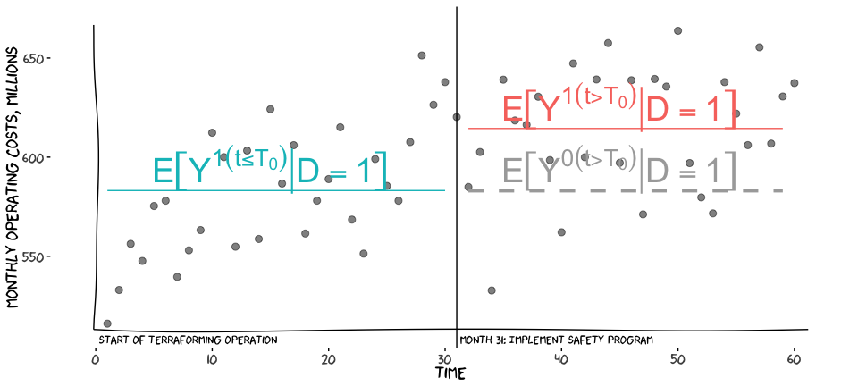<!-- -->


## ATT

Then 

$$
\begin{align}
ATT &= E[Y^1 - Y^0 | D = 1] \\
 &= E[Y^1 | D = 1] - E[Y^0 | D = 1] \\
 &= E[Y^1(t > T_0) | D = 1] - E[Y^0(t > T_0) | D = 1] \\
 &= E[Y^1(t > T_0) | D = 1] - E[Y^1(t < T_0) | D = 1] \\
 & = \bar{X}_{t > T_0} - \bar{X}_{t < T_0}
\end{align}
$$

## t-test
$$
t = \frac{\bar{X}_{post} - \bar{X}_{pre}}{s \sqrt{\frac{2}{n}}}
$$


```r
mean(hh$y[hh$post==1]) - mean(hh$y[hh$post==0])
with(hh, t.test(y ~ post))
```

```
## [1] 31.31477
## 
## 	Welch Two Sample t-test
## 
## data:  y by post
## t = -3.7687, df = 57.917, p-value = 0.0003867
## alternative hypothesis: true difference in means between group 0 and group 1 is not equal to 0
## 95 percent confidence interval:
##  -47.94785 -14.68169
## sample estimates:
## mean in group 0 mean in group 1 
##        583.1383        614.4531
```

## OLS

Similarly, 
$$
Y = \beta_0 + \beta_1 \mbox{POST} + \mathbf{\beta_x X} + \varepsilon
$$


```r
lm_prepost <- lm(y ~ post + weather_index,
           data=hh)
```


```
## # A tibble: 3 × 5
##   term          estimate std.error statistic p.value
##   <chr>            <dbl>     <dbl>     <dbl>   <dbl>
## 1 (Intercept)     553.        9.42     58.7        0
## 2 post             38.5       7.71      4.99       0
## 3 weather_index     5.11      1.34      3.83       0
```

## Assumptions

<!-- **Assumptions:** -->

* Outcomes would stay the same over time in the absence of the intervention
* No unmeasured variables affecting the outcome

<!-- **Accounts for:** -->

<!-- * Baseline value for outcomes -->

<!-- **Does not account for:** -->

<!-- * Outcome was already getting better or worse -->
<!-- * Anything that changed outcomes unrelated to the intervention -->


# Interrupted time series

## Operating costs over time

<!-- -->

## Change in level

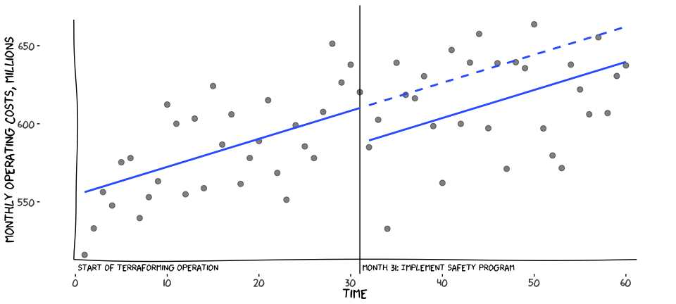<!-- -->

## Change in level

$$
\begin{align}
\mbox{Compare means:} ~~|&~~ Y = \beta_0 + \beta_1 POST + \varepsilon \\
\mbox{ITS (level):} ~~|&~~ Y_{t} = \beta_0 + \beta_1 \mbox{TIME} + \beta_2 \mbox{POST} + \varepsilon_t\\
\end{align}
$$

$$
\begin{align}
ATT &= E[Y^1 - Y^0 | D = 1] \\
 &= E[Y^1 | D = 1] - E[Y^0 | D = 1] \\
 & = \hat{\beta}_2
\end{align}
$$

## Linear model


```r
lm_its <- lm(y ~ t + post,
             data = hh)
```


```
## # A tibble: 3 × 5
##   term        estimate std.error statistic p.value
##   <chr>          <dbl>     <dbl>     <dbl>   <dbl>
## 1 (Intercept)   610.       8.10      75.3    0    
## 2 t               1.80     0.421      4.27   0    
## 3 post          -22.6     14.6       -1.55   0.127
```

## Change in level and slope

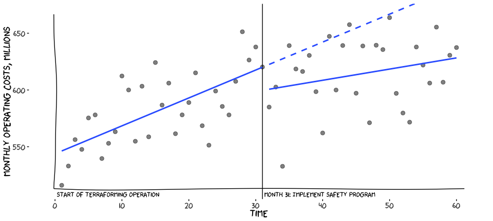<!-- -->

## Change in level and slope | Linear model

$$
\begin{align}
\mbox{Compare means:} ~~|&~~ Y = \beta_0 + \beta_1 POST + \varepsilon \\
\mbox{ITS (level):} ~~|&~~ Y_{t} = \beta_0 + \beta_1 \mbox{TIME} + \beta_2 \mbox{POST} + \varepsilon_t\\
\mbox{ITS (level & slope):} ~~|&~~ Y_{t} = \beta_0 + \beta_1 \mbox{TIME} + \beta_2 \mbox{POST} + \beta_3 \mbox{TIME} \times \mbox{POST} + \varepsilon_t\\
\end{align}
$$

## ATT

$$
Y_{t} = \beta_0 + \beta_1 \mbox{TIME} + \beta_2 \mbox{POST} + \beta_3 \mbox{TIME} \times \mbox{POST} + \varepsilon_t
$$

So for any $t \in T \ge T_0$,

$$
\begin{align}
ATT(t) &= E[Y^1(t) - Y^0(t) | D = 1] \\
 &= E[Y^1(t) | D = 1] - E[Y^0(t) | D = 1] \\
 & = \hat{\beta}_2 + (\hat{\beta}_3 \times t)
\end{align}
$$

## Change in level and slope | Linear model

```r
lm_its2 <- lm(y ~ t*post,
             data = hh)
```


```
## # A tibble: 4 × 5
##   term        estimate std.error statistic p.value
##   <chr>          <dbl>     <dbl>     <dbl>   <dbl>
## 1 (Intercept)   620.       9.73      63.7    0    
## 2 t               2.46     0.557      4.41   0    
## 3 post          -20.4     14.4       -1.42   0.162
## 4 t:post         -1.47     0.831     -1.77   0.081
```

## Interrupted time series

**Assumes** the observations from before the intervention are a reasonable surrogate for the counterfactual condition of the test group to represent what would have happened without an intervention.

**Accounts for** outcomes that were already getting better or worse

**Does not account for** anything unrelated to the intervention that changed outcomes in the post-intervention period

## <span style="color:red">Exogenous</span> variables? {.columns-2}

{width=400}

<p class="forceBreak"></p>

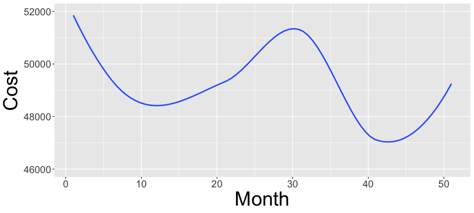


What if there's some external force causing costs to fluctuate over time? 

# Comparative methods

## Fiorina 161
{width=100%, height=90%}

## Fiorina 161 and Hadley's Hope
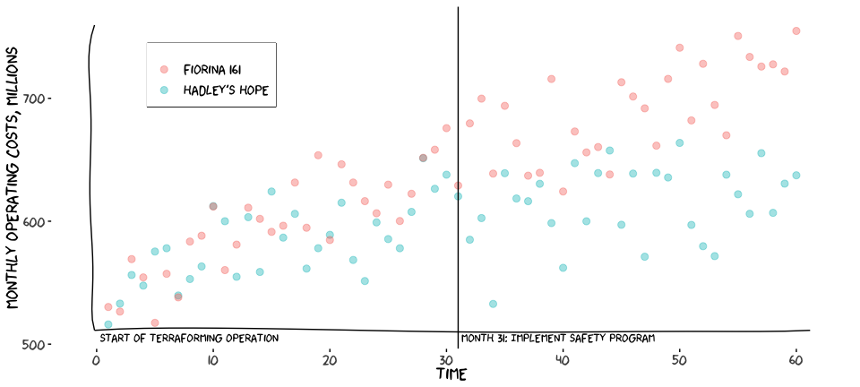<!-- -->

## Two-group post-mean comparison

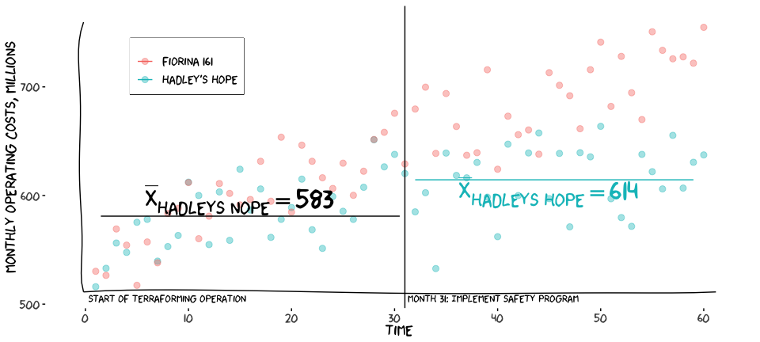<!-- -->

## Two-group post-mean comparison

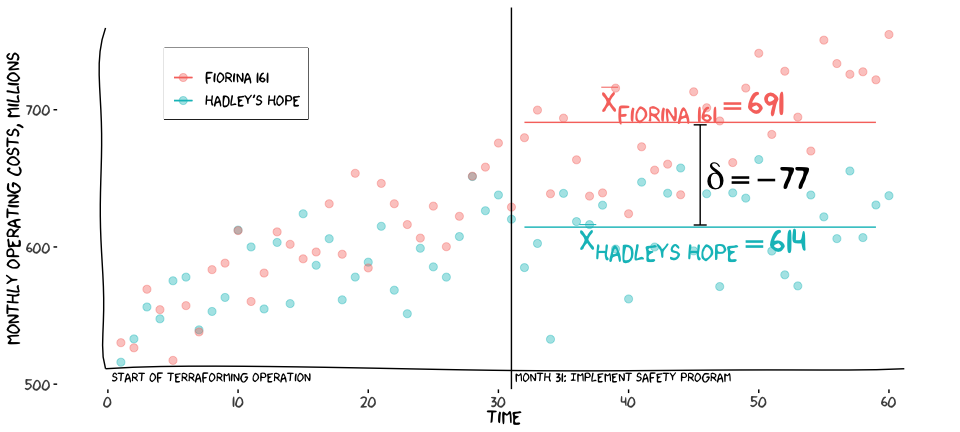<!-- -->

## Two-group post-mean comparison

$$
t = \frac{\bar{X}_{test} - \bar{X}_{comparison}}{s \sqrt{\frac{2}{n}}}
$$


```r
mean(hhf$y[hhf$treat==1]) - mean(hhf$y[hhf$treat==0])
```

```
## [1] -44.78596
```

```r
with(hhf, t.test(y ~ post))
```

```
## 
## 	Welch Two Sample t-test
## 
## data:  y by post
## t = -7.4716, df = 103.55, p-value = 2.617e-11
## alternative hypothesis: true difference in means between group 0 and group 1 is not equal to 0
## 95 percent confidence interval:
##  -78.28028 -45.44163
## sample estimates:
## mean in group 0 mean in group 1 
##        590.7673        652.6282
```

## Two-group post-mean comparison

$$
\begin{align}
\mbox{Test/comparison post-means:} ~~|&~~ Y = \beta_0 + \beta_1 \mbox{TREAT} + \mathbf{\beta_x X} + \varepsilon
\end{align}
$$


```r
lm_2grp <- lm(y ~ treat + weather_index,
           data=hhf %>% filter(post==1))
```


```
## # A tibble: 3 × 5
##   term          estimate std.error statistic p.value
##   <chr>            <dbl>     <dbl>     <dbl>   <dbl>
## 1 (Intercept)     662.        8.50     77.8        0
## 2 treat           -75.8       7.86     -9.64       0
## 3 weather_index     6.31      1.41      4.48       0
```

## Two-group post-mean comparison

* **Assumes** that the comparison group is a good representation of the counterfactual $E[Y^0 | D=1]$; specifically, that outcomes for the two groups would be the same if neither or both had received the intervention

* **Accounts for** anything unrelated to the intervention that changed outcomes equally for both groups

* **Does not account for** any baseline differences in levels or slopes between the two groups or non-intervention <span style="color:red">shocks</span> that affected only one group

# Comparative interrupted time series

## Intuition

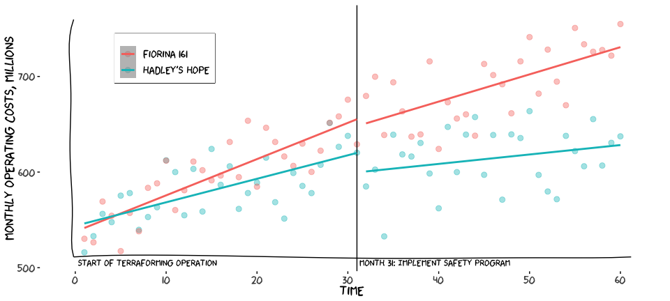<!-- -->

## 

$$
\begin{align}
\mbox{ITS (level):} ~~|&~~ Y_{t} = \beta_0 + \beta_1 \mbox{TIME} + \beta_2 \mbox{POST} + \varepsilon_t\\
\mbox{ITS (level & slope):} ~~|&~~ Y_{t} = \beta_0 + \beta_1 \mbox{TIME} + \beta_2 \mbox{POST} + \beta_3 \mbox{TIME} \times \mbox{POST} + \varepsilon_t\\
\end{align}
$$

$$
\begin{align}
  Y_t =& \beta_0 + \beta_1 \mbox{TIME} + \beta_2 \mbox{POST} + \beta_3 \mbox{POST} \times \mbox{TIME} + \\
     & \beta_4 \mbox{TREAT} + \beta_5 \mbox{TREAT} \times \mbox{TIME } + \\
     & \beta_6 \mbox{TREAT} \times \mbox{POST} + \beta_7 \mbox{TREAT} \times \mbox{POST} \times \mbox{TIME} + \varepsilon_t
\end{align}
$$

where
$$
\mbox{TIME } = \mbox{ {1, ... 60}},\\
\mbox{POST } = \begin{cases}
                0 \mbox{ if TIME} \le 31, \\
                1 \mbox{ if TIME > 31}\\
              \end{cases},\\
\mbox{TREAT } = \begin{cases}
                0 \mbox{ = Fiorina 161}, \\
                1 \mbox{ = Hadley's Hope}
              \end{cases}
$$

##

$$
\begin{align}
  Y_t =& \beta_0 + \beta_1 \mbox{TIME} + \beta_2 \mbox{POST} + \beta_3 \mbox{POST} \times \mbox{TIME} + \\
     & \beta_4 \mbox{TREAT} + \beta_5 \mbox{TREAT} \times \mbox{TIME } + \\
     & \beta_6 \mbox{TREAT} \times \mbox{POST} + \beta_7 \mbox{TREAT} \times \mbox{POST} \times \mbox{TIME} + \varepsilon_t
\end{align}
$$

<center></center>

$$ 
\begin{align}
  ATT(t) = & E[Y^1 | D = 1](t) - E[Y^0 | D = 1](t) \\
  E[Y^1 | D = 1](t) =&  (\beta_0 + \beta_1 t + \beta_2 + \beta_3 t + \beta_4 + \beta_5 t + \beta_6 + \beta_7 t) - \\
  & (\beta_0 + \beta_1 t + \beta_4 + \beta_5 t) \\ 
  =& \beta_2 + \beta_3 t + \beta_6 + \beta_7 t \\
  E[Y^0 | D = 1] =& (\beta_0 + \beta_1 t + \beta_2 + \beta_3 t) - (\beta_0 + \beta_1 t) \\
  =& \beta_2 + \beta_3 t \\
  E[Y^1 | D = 1] - E[Y^0 | D = 1] =& \beta_6 + \beta_7 t
\end{align}
$$


## Model


```r
lm_cits <- lm(y ~ t*post + t*treat + treat*post + I(treat * post * t),
             data = hhf)
```


```
## # A tibble: 8 × 5
##   term                estimate std.error statistic p.value
##   <chr>                  <dbl>     <dbl>     <dbl>   <dbl>
## 1 (Intercept)          655.        9.38     69.8     0    
## 2 t                      3.79      0.537     7.06    0    
## 3 post                  -7.17     13.9      -0.517   0.606
## 4 treat                -35.2      13.3      -2.65    0.009
## 5 I(treat * post * t)   -0.530     1.13     -0.468   0.641
## 6 t:post                -0.944     0.801    -1.18    0.241
## 7 t:treat               -1.33      0.760    -1.75    0.082
## 8 post:treat           -13.2      19.6      -0.673   0.502
```

## Linear combination


```r
summary(multcomp::glht(lm_cits, 
             linfct = matrix(c(0, 0, 0, 0, 12, 0, 0, 1), 1)))
```

```
## 
## 	 Simultaneous Tests for General Linear Hypotheses
## 
## Fit: lm(formula = y ~ t * post + t * treat + treat * post + I(treat * 
##     post * t), data = hhf)
## 
## Linear Hypotheses:
##        Estimate Std. Error t value Pr(>|t|)
## 1 == 0   -19.56      22.86  -0.855    0.394
## (Adjusted p values reported -- single-step method)
```


# Difference in differences

## DiD: Intuition

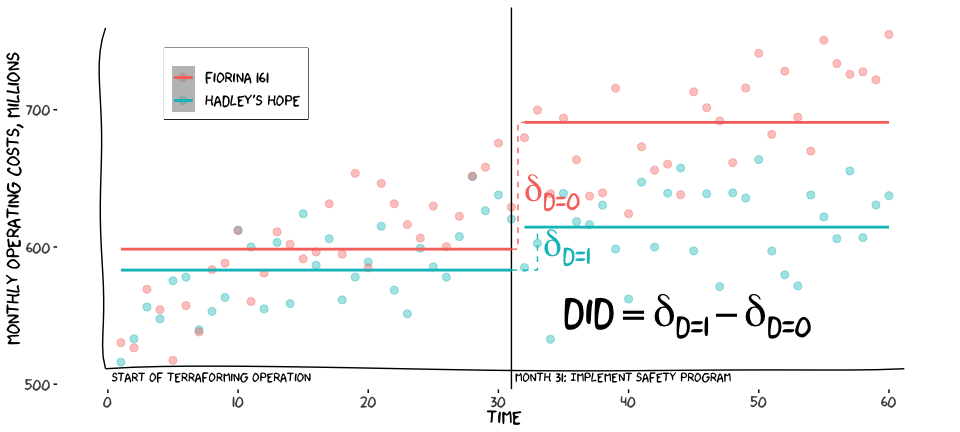<!-- -->

## ATT

$$
\begin{align}
  ATT =& E\left[\bar{Y^1}_{t > T_0} - \bar{Y^1}_{t \le T_0} | D = 1 \right] - E\left[\bar{Y^0}_{t > T_0} - \bar{Y^0}_{t \le T_0} | D = 1 \right]
\end{align}
$$

Counterfactual assumption

$$
\begin{align}
  E\left[\bar{Y^0}_{t > T_0} - \bar{Y^0}_{t \le T_0} | D = 1 \right] &\approx E\left[\bar{Y^0}_{t > T_0} - \bar{Y^0}_{t \le T_0} | D = 0 \right] \\
\end{align}
$$
Then

$$
\begin{align}
  ATT &\approx E\left[\bar{Y^1}_{t > T_0} - \bar{Y^1}_{t \le T_0} | D = 1 \right] - E\left[\bar{Y^0}_{t > T_0} - \bar{Y^0}_{t \le T_0} | D = 0 \right] \\ 
\end{align}
$$

## A crude DiD

# A tibble: 2 × 4
  Colony                     Pre  Post Difference
  <chr>                    <dbl> <dbl>      <dbl>
1 Fiorina 161 (comparison)   598   691         93
2 Hadley's Hope (test)       583   614         31

<br>


```r
31-93
```

```
## [1] -62
```


## Linear model

$$
\begin{align}
Y &= \beta_0 + \beta_1 \mbox{TREAT} + \beta_2 \mbox{POST} + \\
  & ~~~~~~~~~~~~~\beta_3 \mbox{TREAT} \times \mbox{POST} + \varepsilon \\
E\left[\bar{Y^1}_{t > T_0} - \bar{Y^1}_{t \le T_0} | D = 1 \right] &= [\beta_0 + \beta_1 + \beta_2 + \beta_3] - [\beta_0 + \beta_1] = \beta_2 + \beta_3 \\
E\left[\bar{Y^0}_{t > T_0} - \bar{Y^0}_{t \le T_0} | D = 0 \right] &= [\beta_0 + \beta_2] - [\beta_0] = \beta_2 \\
ATT &= [\beta_2 + \beta_3] - [\beta_2] = \beta_3
\end{align}
$$

## Linear model


```
## # A tibble: 4 × 5
##   term        estimate std.error statistic   p.value
##   <chr>          <dbl>     <dbl>     <dbl>     <dbl>
## 1 (Intercept)    598.       6.44     92.9  9.90e-111
## 2 treat          -15.3      9.11     -1.67 9.67e-  2
## 3 post            92.4      9.27      9.97 2.75e- 17
## 4 treat:post     -61.1     13.1      -4.66 8.45e-  6
```

## Linear model, econ-ish specification with <span style="color:red">unit and time fixed effects</span>

$$
\begin{align}
y_{it} &= \beta_0 + \beta_1 \mbox{TREAT} \times \mbox{POST} + \alpha_i + \gamma_t + \varepsilon_{it} \\
\end{align}
$$

## Linear model with unit and time fixed effects


```r
lm_did <- lm(y ~ tx_post + t_f + colony,
                  data=hhf)
```


```
## # A tibble: 62 × 5
##    term                estimate std.error statistic  p.value
##    <chr>                  <dbl>     <dbl>     <dbl>    <dbl>
##  1 (Intercept)           531.       18.8     28.3   1.23e-35
##  2 tx_postTRUE           -61.1       9.54    -6.41  2.90e- 8
##  3 t_f-29                  6.62     26.1      0.253 8.01e- 1
##  4 t_f-28                 39.6      26.1      1.52  1.35e- 1
##  5 t_f-27                 27.8      26.1      1.07  2.91e- 1
##  6 t_f-26                 23.2      26.1      0.889 3.77e- 1
##  7 t_f-25                 44.5      26.1      1.70  9.36e- 2
##  8 t_f-24                 15.7      26.1      0.602 5.50e- 1
##  9 t_f-23                 45.1      26.1      1.73  8.93e- 2
## 10 t_f-22                 52.6      26.1      2.01  4.86e- 2
## 11 t_f-21                 89.0      26.1      3.41  1.19e- 3
## 12 t_f-20                 57.0      26.1      2.18  3.31e- 2
## 13 t_f-19                 44.8      26.1      1.72  9.16e- 2
## 14 t_f-18                 84.0      26.1      3.22  2.11e- 3
## 15 t_f-17                 57.2      26.1      2.19  3.25e- 2
## 16 t_f-16                 84.6      26.1      3.24  1.97e- 3
## 17 t_f-15                 68.4      26.1      2.62  1.12e- 2
## 18 t_f-14                 95.6      26.1      3.66  5.41e- 4
## 19 t_f-13                 55.0      26.1      2.11  3.96e- 2
## 20 t_f-12                 92.7      26.1      3.55  7.66e- 4
## 21 t_f-11                 63.7      26.1      2.44  1.78e- 2
## 22 t_f-10                108.       26.1      4.12  1.22e- 4
## 23 t_f-9                  76.9      26.1      2.94  4.65e- 3
## 24 t_f-8                  60.7      26.1      2.33  2.36e- 2
## 25 t_f-7                  79.6      26.1      3.05  3.44e- 3
## 26 t_f-6                  84.5      26.1      3.24  2.00e- 3
## 27 t_f-5                  66.0      26.1      2.53  1.43e- 2
## 28 t_f-4                  91.8      26.1      3.52  8.52e- 4
## 29 t_f-3                 128.       26.1      4.92  7.63e- 6
## 30 t_f-2                 119.       26.1      4.56  2.65e- 5
## 31 t_f-1                 134.       26.1      5.12  3.63e- 6
## 32 t_f0                  102.       26.1      3.89  2.62e- 4
## 33 t_f1                  140.       26.5      5.26  2.14e- 6
## 34 t_f2                  159.       26.5      5.98  1.49e- 7
## 35 t_f3                   93.2      26.5      3.51  8.71e- 4
## 36 t_f4                  174.       26.5      6.55  1.64e- 8
## 37 t_f5                  148.       26.5      5.59  6.32e- 7
## 38 t_f6                  134.       26.5      5.05  4.63e- 6
## 39 t_f7                  142.       26.5      5.36  1.48e- 6
## 40 t_f8                  165.       26.5      6.20  6.35e- 8
## 41 t_f9                  101.       26.5      3.79  3.61e- 4
## 42 t_f10                 168.       26.5      6.31  4.12e- 8
## 43 t_f11                 135.       26.5      5.10  3.88e- 6
## 44 t_f12                 157.       26.5      5.92  1.83e- 7
## 45 t_f13                 155.       26.5      5.85  2.42e- 7
## 46 t_f14                 163.       26.5      6.12  8.49e- 8
## 47 t_f15                 178.       26.5      6.69  9.70e- 9
## 48 t_f16                 139.       26.5      5.23  2.39e- 6
## 49 t_f17                 158.       26.5      5.95  1.65e- 7
## 50 t_f18                 183.       26.5      6.90  4.31e- 9
## 51 t_f19                 210.       26.5      7.91  8.74e-11
## 52 t_f20                 147.       26.5      5.54  7.80e- 7
## 53 t_f21                 161.       26.5      6.08  1.01e- 7
## 54 t_f22                 141.       26.5      5.30  1.91e- 6
## 55 t_f23                 161.       26.5      6.08  1.01e- 7
## 56 t_f24                 194.       26.5      7.30  9.15e-10
## 57 t_f25                 177.       26.5      6.68  1.01e- 8
## 58 t_f26                 198.       26.5      7.46  4.90e-10
## 59 t_f27                 175.       26.5      6.58  1.47e- 8
## 60 t_f28                 184.       26.5      6.92  4.00e- 9
## 61 t_f29                 204.       26.5      7.67  2.20e-10
## 62 colonyHadley's Hope   -15.3       6.63    -2.30  2.50e- 2
```

## Difference in differences

* **Assumes** the pre-post difference in the control group is a reasonable surrogate for the counterfactual condition of the test group; 

* **Traditionally**, we would say the assumption is that the test and control groups' longitudinal trends in the pre-intervention period are parallel. See Health Policy Data Science Lab's website for a nuanced discussion. 

* Also assumes common <span style="color:red">shocks</span>. 

* **Accounts for** baseline differences in outcomes between the two groups and shocks unrelated to the intervention that affected both groups

* **Does not account for** Shocks unrelated to the intervention that only occurred in one group or differences between groups in the longitudinal trajectory before the intervention

## Assumptions

* "Parallel trends"?
* "Counterfactual assumption"?

## Parallel trends

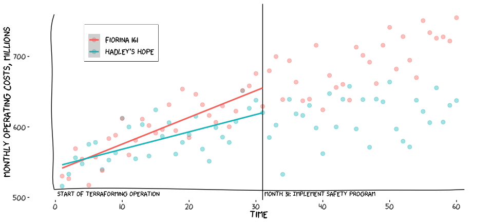<!-- -->

## Test for parallel trends

$$
\begin{align}
  Y = \beta_0 + \beta_1 t +\beta_2 \mbox{TREAT} + \beta_3 \mbox{TREAT} \times t + \varepsilon
\end{align}
$$


```
## 
## Call:
## lm(formula = y ~ t * treat, data = hhf %>% filter(post == 0))
## 
## Residuals:
##     Min      1Q  Median      3Q     Max 
## -49.024 -18.736  -2.664  19.430  43.922 
## 
## Coefficients:
##             Estimate Std. Error t value Pr(>|t|)    
## (Intercept) 655.2661     8.1553  80.348  < 2e-16 ***
## t             3.7913     0.4670   8.119 3.87e-11 ***
## treat       -35.2285    11.5334  -3.054   0.0034 ** 
## t:treat      -1.3314     0.6604  -2.016   0.0484 *  
## ---
## Signif. codes:  0 '***' 0.001 '**' 0.01 '*' 0.05 '.' 0.1 ' ' 1
## 
## Residual standard error: 23.26 on 58 degrees of freedom
## Multiple R-squared:  0.6337,	Adjusted R-squared:  0.6148 
## F-statistic: 33.45 on 3 and 58 DF,  p-value: 1.111e-12
```

## 

{height=250}

* Match or weight by propensity score — but don't include the outcome
* Explicitly model the difference between trends — but misspecification can introduce bias
* Choose a better control group
* Give up. Go do a different study.

## Raise your hand if you just love all of this.

Let's conduct our analysis conditional on getting $p > 0.05$ on a hypothesis test where the thing we're trying to show isn't a thing is set up as the null hypothesis. 

## Do you have a better idea?

* Think more carefully about how the ATT is defined; "the test of parallel trends is neither necessary nor sufficient."
* Equivalence testing (Hartman and Hidalgo 2018)
* Model specification that accounts for non-parallel trends (Bilinski and Hatfield 2019)
* Extrapolate the deviation from the pre-intervention period into the post-intervention period (Rambachan and Roth 2019)

# Fixed effects

## Colonies

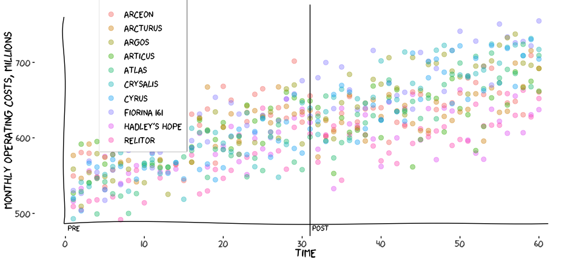<!-- -->

## Three methods

* Difference score
* Unit and time dummy variables
* De-meaning

## Notation

$$
y_{it} = \mu_t + \beta \mathbf{x}_{it} + \gamma \mathbf{z_i} + \alpha_i + \varepsilon_{it}
$$
$$
\begin{align}
  \mu_t &~ \mbox{ is a time-varying intercept} \\
  \mathbf{x}_{it} &~ \mbox{ is a vector of time-varying covariates} \\
  \mathbf{z}_{i} &~ \mbox{ is a vector of time-invariant covariates} \\
  \beta, \gamma &~ \mbox{ are coefficients} \\
  \mathbf{\alpha}_i &~\mbox{ is time-invariant error for individuals} \\
  \varepsilon_{it} &~ \mbox{ is error for each individual at each time}
\end{align}
$$

## Two periods

$$
\begin{align}
  y_{i1} & = \mu_1 + \beta \mathbf{x}_{i1} + \gamma \mathbf{z}_i + \alpha_i + \varepsilon_{i1} \\
  y_{i2} & = \mu_2 + \beta \mathbf{x}_{i2} + \gamma \mathbf{z}_i + \alpha_i + \varepsilon_{i2} \\
  y_{i2} - y_{i1} &= (\mu_2 - \mu_1) + \beta(\mathbf{x}_{i2} - \mathbf{x}_{i1}) + (\varepsilon_{i1} - \varepsilon_{i2}) \\
  \Delta y_i &= \Delta \mu + \beta \Delta \mathbf{x}_i + \Delta \varepsilon_i
\end{align}
$$

* $\alpha_i$ and $\gamma \mathbf{z}_i$ go away
* Cannot estimate $\gamma$


## Two-period data, many colonies


```
## # A tibble: 20 × 6
##    colony        treat  post tx_post weather_index     y
##    <chr>         <dbl> <dbl>   <dbl>         <dbl> <dbl>
##  1 Arceon            1     0       0          5.36  610.
##  2 Arceon            1     1       1          5.79  644.
##  3 Arcturus          1     0       0          5.33  603.
##  4 Arcturus          1     1       1          5.14  637.
##  5 Argos             0     0       0          5.03  592.
##  6 Argos             0     1       0          4.67  679.
##  7 Articus           1     0       0          6.24  602.
##  8 Articus           1     1       1          5.02  632.
##  9 Atlas             0     0       0          5.54  562.
## 10 Atlas             0     1       0          5.41  656.
## 11 Crysalis          0     0       0          4.68  582.
## 12 Crysalis          0     1       0          5.82  683.
## 13 Cyrus             0     0       0          4.78  573.
## 14 Cyrus             0     1       0          4.80  666.
## 15 Fiorina 161       0     0       0          5.29  598.
## 16 Fiorina 161       0     1       0          4.57  691.
## 17 Hadley's Hope     1     0       0          5.88  583.
## 18 Hadley's Hope     1     1       1          4.49  614.
## 19 Relitor           1     0       0          4.52  559.
## 20 Relitor           1     1       1          4.78  607.
```


## Calculate differences


```r
(colonies_diff <- colonies_2p %>%
       pivot_wider(names_from = post,
                   values_from = c(tx_post, weather_index, y)) %>%
       mutate(delta_y = y_1 - y_0,
              delta_txpost = tx_post_1 - tx_post_0,
              delta_weather = weather_index_1 - weather_index_0) %>%
   select(colony, starts_with("delta")))
```

```
## # A tibble: 10 × 4
##    colony        delta_y delta_txpost delta_weather
##    <chr>           <dbl>        <dbl>         <dbl>
##  1 Arceon           34.0            1        0.437 
##  2 Arcturus         34.0            1       -0.187 
##  3 Argos            86.6            0       -0.356 
##  4 Articus          30.7            1       -1.22  
##  5 Atlas            94.3            0       -0.125 
##  6 Crysalis        101.             0        1.14  
##  7 Cyrus            93.8            0        0.0146
##  8 Fiorina 161      92.4            0       -0.714 
##  9 Hadley's Hope    31.3            1       -1.40  
## 10 Relitor          48.1            1        0.263
```

## Difference score method

$$
\Delta y_i = \Delta \mu + \beta_1 \Delta \mbox{TREAT}_i + \beta_2 \mbox{WEATHER} + \Delta \varepsilon_i
$$


```r
lm_fe1 <- lm(delta_y ~ delta_txpost + delta_weather, data = colonies_diff)
tidy(lm_fe1)
```

```
## # A tibble: 3 × 5
##   term          estimate std.error statistic  p.value
##   <chr>            <dbl>     <dbl>     <dbl>    <dbl>
## 1 (Intercept)      93.7       2.15     43.5  8.82e-10
## 2 delta_txpost    -55.7       3.18    -17.5  4.80e- 7
## 3 delta_weather     5.58      2.20      2.54 3.88e- 2
```


## Unit and time dummy variables

$$ 
\begin{align}
y_{it} & = \beta_0 + \beta_1 \mbox{TREAT} \times \mbox{POST} + \alpha_i + \gamma_t  + \varepsilon_{it} , \\\\
\mbox{where} \\
\alpha_i & \mbox{ are colony fixed effects, and } \\
\gamma_t & \mbox{ are time fixed effects}
\end{align}
$$

## Unit and time dummy variables, 2 periods


```r
lm_fe2 <- lm(y ~ tx_post + weather_index + colony + post, data=colonies_2p)
```


```
## # A tibble: 13 × 5
##    term                estimate std.error statistic  p.value
##    <chr>                  <dbl>     <dbl>     <dbl>    <dbl>
##  1 (Intercept)           577.       13.0      44.4  7.67e-10
##  2 tx_post               -55.7       3.18    -17.5  4.80e- 7
##  3 weather_index           5.58      2.20      2.54 3.88e- 2
##  4 colonyArcturus         -4.55      3.49     -1.31 2.33e- 1
##  5 colonyArgos           -15.1       4.25     -3.54 9.48e- 3
##  6 colonyArticus          -9.86      3.41     -2.89 2.32e- 2
##  7 colonyAtlas           -45.0       3.79    -11.9  6.85e- 6
##  8 colonyCrysalis        -20.6       3.91     -5.28 1.15e- 3
##  9 colonyCyrus           -30.7       4.32     -7.10 1.94e- 4
## 10 colonyFiorina 161      -6.37      4.17     -1.53 1.71e- 1
## 11 colonyHadley's Hope   -25.7       3.51     -7.33 1.59e- 4
## 12 colonyRelitor         -38.3       3.97     -9.65 2.71e- 5
## 13 post                   93.7       2.15     43.5  8.82e-10
```

## Unit and time dummy variables, 60 periods


```r
lm_fe3 <- lm(y ~ tx_post + weather_index + colony + t_f, data=colonies)
```


```
## # A tibble: 71 × 5
##    term                estimate std.error statistic   p.value
##    <chr>                  <dbl>     <dbl>     <dbl>     <dbl>
##  1 (Intercept)           530.       7.35     72.2   4.41e-276
##  2 tx_postTRUE           -56.1      3.45    -16.2   1.86e- 48
##  3 weather_index           4.80     0.315    15.2   9.52e- 44
##  4 colonyArcturus         -4.87     3.85     -1.26  2.07e-  1
##  5 colonyArgos           -15.8      4.21     -3.75  1.94e-  4
##  6 colonyArticus          -9.89     3.85     -2.57  1.05e-  2
##  7 colonyAtlas           -45.3      4.20    -10.8   1.11e- 24
##  8 colonyCrysalis        -21.2      4.20     -5.04  6.39e-  7
##  9 colonyCyrus           -31.5      4.21     -7.49  2.93e- 13
## 10 colonyFiorina 161      -7.16     4.21     -1.70  8.92e-  2
## 11 colonyHadley's Hope   -26.1      3.85     -6.78  3.26e- 11
## 12 colonyRelitor         -39.2      3.86    -10.2   2.97e- 22
## 13 t_f-29                  1.36     9.44      0.144 8.85e-  1
## 14 t_f-28                 18.3      9.45      1.93  5.38e-  2
## 15 t_f-27                 17.1      9.44      1.81  7.03e-  2
## 16 t_f-26                 11.4      9.45      1.21  2.27e-  1
## 17 t_f-25                 20.1      9.46      2.12  3.45e-  2
## 18 t_f-24                 22.0      9.44      2.33  2.00e-  2
## 19 t_f-23                 23.2      9.46      2.45  1.46e-  2
## 20 t_f-22                 30.2      9.46      3.19  1.50e-  3
## 21 t_f-21                 37.6      9.44      3.98  7.71e-  5
## 22 t_f-20                 54.0      9.44      5.72  1.76e-  8
## 23 t_f-19                 38.8      9.44      4.11  4.58e-  5
## 24 t_f-18                 44.9      9.45      4.75  2.58e-  6
## 25 t_f-17                 51.2      9.45      5.42  9.12e-  8
## 26 t_f-16                 50.0      9.44      5.30  1.74e-  7
## 27 t_f-15                 52.9      9.45      5.60  3.46e-  8
## 28 t_f-14                 58.4      9.47      6.17  1.39e-  9
## 29 t_f-13                 59.8      9.44      6.34  5.07e- 10
## 30 t_f-12                 62.7      9.44      6.64  7.70e- 11
## 31 t_f-11                 59.2      9.45      6.26  7.96e- 10
## 32 t_f-10                 69.5      9.44      7.36  7.10e- 13
## 33 t_f-9                  59.2      9.45      6.26  7.99e- 10
## 34 t_f-8                  63.6      9.46      6.72  4.75e- 11
## 35 t_f-7                  70.9      9.44      7.51  2.54e- 13
## 36 t_f-6                  82.1      9.44      8.69  4.47e- 17
## 37 t_f-5                  75.3      9.44      7.97  9.75e- 15
## 38 t_f-4                  76.8      9.44      8.14  2.85e- 15
## 39 t_f-3                  87.3      9.46      9.23  6.38e- 19
## 40 t_f-2                  99.9      9.45     10.6   8.00e- 24
## 41 t_f-1                  84.8      9.45      8.98  4.84e- 18
## 42 t_f0                   91.2      9.45      9.66  2.01e- 20
## 43 t_f1                  107.       9.61     11.1   5.07e- 26
## 44 t_f2                  119.       9.60     12.4   4.36e- 31
## 45 t_f3                  106.       9.60     11.0   1.50e- 25
## 46 t_f4                  121.       9.62     12.6   4.02e- 32
## 47 t_f5                  128.       9.60     13.3   4.41e- 35
## 48 t_f6                  122.       9.59     12.7   2.19e- 32
## 49 t_f7                  125.       9.60     13.1   4.68e- 34
## 50 t_f8                  139.       9.61     14.4   4.66e- 40
## 51 t_f9                  123.       9.59     12.8   7.68e- 33
## 52 t_f10                 145.       9.60     15.1   5.52e- 43
## 53 t_f11                 128.       9.60     13.4   2.25e- 35
## 54 t_f12                 131.       9.61     13.6   1.66e- 36
## 55 t_f13                 143.       9.60     14.9   4.13e- 42
## 56 t_f14                 131.       9.61     13.6   1.69e- 36
## 57 t_f15                 146.       9.61     15.2   1.15e- 43
## 58 t_f16                 148.       9.60     15.4   1.67e- 44
## 59 t_f17                 150.       9.61     15.6   1.40e- 45
## 60 t_f18                 152.       9.61     15.8   2.53e- 46
## 61 t_f19                 154.       9.66     15.9   6.48e- 47
## 62 t_f20                 149.       9.59     15.5   4.30e- 45
## 63 t_f21                 158.       9.61     16.4   2.38e- 49
## 64 t_f22                 143.       9.59     14.9   2.73e- 42
## 65 t_f23                 169.       9.62     17.5   1.46e- 54
## 66 t_f24                 165.       9.60     17.2   6.94e- 53
## 67 t_f25                 169.       9.61     17.6   8.10e- 55
## 68 t_f26                 185.       9.59     19.3   4.33e- 63
## 69 t_f27                 173.       9.60     18.0   8.30e- 57
## 70 t_f28                 182.       9.61     18.9   1.84e- 61
## 71 t_f29                 180.       9.61     18.7   2.66e- 60
```

## Variance

* Key assumption in linear regression is **independent observations**. 
* Repeated observations within each colony are correlated. 
* Failure to account for this correlation will usually (but not always) bias standard errors downward, yielding optimistic precision.

## "STATA"-flavored standard errors

Eicker-Huber-White variance

$$
\begin{align}
&\frac{N}{N-K}(\mathbf{X}^\prime \mathbf{X})^{-1} \mbox{diag} [e^2_i] \mathbf{X} (\mathbf{X}^\prime \mathbf{X})^{-1}, \\
&df = N-K
\end{align}
$$

In general, clustering at a higher level accounts for nested levels of correlation

## vcovHC and lmtest


```r
# Fit the model
lm_fe3 <- lm(y ~ tx_post + colony + weather_index + t_f, data=colonies)

# Estimate heteroskedasticity-consistent covariance matrix
vcv_lm_fe <- sandwich::vcovHC(lm_fe3, cluster=colonies$colony)

# Coeftest
lm_fe3_hc <- lmtest::coeftest(lm_fe3, vcv_lm_fe)
```

## OLS versus HC standard errors 


```r
# OLS results
tidy(lm_fe3) %>% filter(!str_detect(term, "^colony|^t_f"))
```

```
## # A tibble: 3 × 5
##   term          estimate std.error statistic   p.value
##   <chr>            <dbl>     <dbl>     <dbl>     <dbl>
## 1 (Intercept)     530.       7.35       72.2 4.41e-276
## 2 tx_postTRUE     -56.1      3.45      -16.2 1.86e- 48
## 3 weather_index     4.80     0.315      15.2 9.52e- 44
```

```r
# HC results
tidy(lm_fe3_hc) %>%
  filter(!str_detect(term, "^colony|^t_f"))
```

```
## # A tibble: 3 × 5
##   term          estimate std.error statistic   p.value
##   <chr>            <dbl>     <dbl>     <dbl>     <dbl>
## 1 (Intercept)     530.       6.26       84.7 6.75e-310
## 2 tx_postTRUE     -56.1      3.67      -15.3 6.67e- 44
## 3 weather_index     4.80     0.329      14.6 1.04e- 40
```

## De-meaning

$$
\begin{align}
y_{it} & = \beta_0 + \mathbf{\beta x}_{it} + \alpha_i + \gamma_t  + \varepsilon_{it} \\
y^*_{it} & = \beta_0 + \beta \mathbf{x}^*_{it} + \gamma_t  + \varepsilon_{it} , \\\\
y^*_{it} & = y_{it} - \frac{1}{n_i}\sum_t y_{it}, ~~~~~~~~~~~~~~~~\mathbf{x}^*_{it} = \mathbf{x}_{it} - \frac{1}{n_i}\sum_t \mathbf{x}_{it}
\end{align}
$$

## Mean deviation algorithm


```r
lm_demean <- colonies %>%
  group_by(colony) %>%
  mutate(y_star = y - mean(y),
         tx_post_star = as.numeric(tx_post) - mean(as.numeric(tx_post)),
         weather_star = weather_index - mean(weather_index)) %>%
  lm(y_star ~ tx_post_star + weather_star + t_f,
     data=.)

# Results
tidy(lmtest::coeftest(lm_demean, 
                      sandwich::vcovHC(lm_demean, cluster=colonies$colony))) %>%
  filter(!str_detect(term, "^colony|^t_f"))
```

```
## # A tibble: 3 × 5
##   term         estimate std.error statistic  p.value
##   <chr>           <dbl>     <dbl>     <dbl>    <dbl>
## 1 (Intercept)    -96.1      5.14      -18.7 2.33e-60
## 2 tx_post_star   -56.1      3.61      -15.5 3.14e-45
## 3 weather_star     4.80     0.323      14.8 6.02e-42
```

## Package estimatr 

```r
tidy(estimatr::lm_robust(y ~ tx_post + weather_index,
          fixed_effects = ~ colony + t_f,
          clusters = colony,
          se_type = "stata",
          data=colonies))
```

```
##            term   estimate std.error statistic      p.value   conf.low
## 1   tx_postTRUE -56.066789 2.8722326 -19.52028 1.124640e-08 -62.564231
## 2 weather_index   4.795408 0.2413074  19.87261 9.605851e-09   4.249533
##    conf.high df outcome
## 1 -49.569348  9       y
## 2   5.341283  9       y
```

## Benchmarking

```r
bench <- map_dfr(1:100, 
                 function(i) {
                   tic(paste0("lm() iteration ", i))
                   # Fit the model
                   lm_fe <- lm(y ~ tx_post + weather_index + colony + t_f,
                               data=colonies)
                   
                   # Estimate heteroskedasticity-consistent covariance matrix
                   vcv_lm_fe <- sandwich::vcovHC(lm_fe, cluster=colonies$colony) 
                   
                   # Results
                   rslts <- tidy(lmtest::coeftest(lm_fe, vcv_lm_fe)) %>%
                     filter(!str_detect(term, "^colony|^t_f"))
                   tt_lm <- toc()
                   
                   tic(paste0("lm_robust() iteration ", i))
                   rslts2 <- tidy(estimatr::lm_robust(y ~ tx_post + weather_index,
                                                      fixed_effects = ~ colony + t_f,
                                                      clusters = colony,
                                                      se_type = "stata",
                                                      data=colonies))
                   tt_lmr <- toc()
                   
                   return(tibble(lm = tt_lm$toc - tt_lm$tic,
                                 lm_robust = tt_lmr$toc - tt_lmr$tic))
                 })
```

```
## lm() iteration 1: 0.014 sec elapsed
## lm_robust() iteration 1: 0.1 sec elapsed
## lm() iteration 2: 0.013 sec elapsed
## lm_robust() iteration 2: 0.002 sec elapsed
## lm() iteration 3: 0.012 sec elapsed
## lm_robust() iteration 3: 0.003 sec elapsed
## lm() iteration 4: 0.012 sec elapsed
## lm_robust() iteration 4: 0.003 sec elapsed
## lm() iteration 5: 0.012 sec elapsed
## lm_robust() iteration 5: 0.003 sec elapsed
## lm() iteration 6: 0.013 sec elapsed
## lm_robust() iteration 6: 0.002 sec elapsed
## lm() iteration 7: 0.013 sec elapsed
## lm_robust() iteration 7: 0.006 sec elapsed
## lm() iteration 8: 0.012 sec elapsed
## lm_robust() iteration 8: 0.003 sec elapsed
## lm() iteration 9: 0.013 sec elapsed
## lm_robust() iteration 9: 0.002 sec elapsed
## lm() iteration 10: 0.012 sec elapsed
## lm_robust() iteration 10: 0.003 sec elapsed
## lm() iteration 11: 0.013 sec elapsed
## lm_robust() iteration 11: 0.003 sec elapsed
## lm() iteration 12: 0.012 sec elapsed
## lm_robust() iteration 12: 0.003 sec elapsed
## lm() iteration 13: 0.013 sec elapsed
## lm_robust() iteration 13: 0.007 sec elapsed
## lm() iteration 14: 0.013 sec elapsed
## lm_robust() iteration 14: 0.002 sec elapsed
## lm() iteration 15: 0.013 sec elapsed
## lm_robust() iteration 15: 0.003 sec elapsed
## lm() iteration 16: 0.013 sec elapsed
## lm_robust() iteration 16: 0.003 sec elapsed
## lm() iteration 17: 0.013 sec elapsed
## lm_robust() iteration 17: 0.003 sec elapsed
## lm() iteration 18: 0.012 sec elapsed
## lm_robust() iteration 18: 0.003 sec elapsed
## lm() iteration 19: 0.016 sec elapsed
## lm_robust() iteration 19: 0.002 sec elapsed
## lm() iteration 20: 0.012 sec elapsed
## lm_robust() iteration 20: 0.003 sec elapsed
## lm() iteration 21: 0.013 sec elapsed
## lm_robust() iteration 21: 0.002 sec elapsed
## lm() iteration 22: 0.012 sec elapsed
## lm_robust() iteration 22: 0.003 sec elapsed
## lm() iteration 23: 0.012 sec elapsed
## lm_robust() iteration 23: 0.003 sec elapsed
## lm() iteration 24: 0.012 sec elapsed
## lm_robust() iteration 24: 0.003 sec elapsed
## lm() iteration 25: 0.017 sec elapsed
## lm_robust() iteration 25: 0.003 sec elapsed
## lm() iteration 26: 0.012 sec elapsed
## lm_robust() iteration 26: 0.003 sec elapsed
## lm() iteration 27: 0.013 sec elapsed
## lm_robust() iteration 27: 0.002 sec elapsed
## lm() iteration 28: 0.012 sec elapsed
## lm_robust() iteration 28: 0.002 sec elapsed
## lm() iteration 29: 0.012 sec elapsed
## lm_robust() iteration 29: 0.003 sec elapsed
## lm() iteration 30: 0.013 sec elapsed
## lm_robust() iteration 30: 0.003 sec elapsed
## lm() iteration 31: 0.018 sec elapsed
## lm_robust() iteration 31: 0.003 sec elapsed
## lm() iteration 32: 0.012 sec elapsed
## lm_robust() iteration 32: 0.004 sec elapsed
## lm() iteration 33: 0.013 sec elapsed
## lm_robust() iteration 33: 0.003 sec elapsed
## lm() iteration 34: 0.012 sec elapsed
## lm_robust() iteration 34: 0.004 sec elapsed
## lm() iteration 35: 0.013 sec elapsed
## lm_robust() iteration 35: 0.003 sec elapsed
## lm() iteration 36: 0.017 sec elapsed
## lm_robust() iteration 36: 0.003 sec elapsed
## lm() iteration 37: 0.014 sec elapsed
## lm_robust() iteration 37: 0.003 sec elapsed
## lm() iteration 38: 0.014 sec elapsed
## lm_robust() iteration 38: 0.003 sec elapsed
## lm() iteration 39: 0.014 sec elapsed
## lm_robust() iteration 39: 0.003 sec elapsed
## lm() iteration 40: 0.014 sec elapsed
## lm_robust() iteration 40: 0.004 sec elapsed
## lm() iteration 41: 0.018 sec elapsed
## lm_robust() iteration 41: 0.003 sec elapsed
## lm() iteration 42: 0.013 sec elapsed
## lm_robust() iteration 42: 0.003 sec elapsed
## lm() iteration 43: 0.013 sec elapsed
## lm_robust() iteration 43: 0.003 sec elapsed
## lm() iteration 44: 0.012 sec elapsed
## lm_robust() iteration 44: 0.003 sec elapsed
## lm() iteration 45: 0.012 sec elapsed
## lm_robust() iteration 45: 0.003 sec elapsed
## lm() iteration 46: 0.012 sec elapsed
## lm_robust() iteration 46: 0.007 sec elapsed
## lm() iteration 47: 0.012 sec elapsed
## lm_robust() iteration 47: 0.003 sec elapsed
## lm() iteration 48: 0.012 sec elapsed
## lm_robust() iteration 48: 0.003 sec elapsed
## lm() iteration 49: 0.012 sec elapsed
## lm_robust() iteration 49: 0.003 sec elapsed
## lm() iteration 50: 0.012 sec elapsed
## lm_robust() iteration 50: 0.003 sec elapsed
## lm() iteration 51: 0.012 sec elapsed
## lm_robust() iteration 51: 0.007 sec elapsed
## lm() iteration 52: 0.013 sec elapsed
## lm_robust() iteration 52: 0.002 sec elapsed
## lm() iteration 53: 0.012 sec elapsed
## lm_robust() iteration 53: 0.003 sec elapsed
## lm() iteration 54: 0.012 sec elapsed
## lm_robust() iteration 54: 0.003 sec elapsed
## lm() iteration 55: 0.012 sec elapsed
## lm_robust() iteration 55: 0.003 sec elapsed
## lm() iteration 56: 0.017 sec elapsed
## lm_robust() iteration 56: 0.003 sec elapsed
## lm() iteration 57: 0.012 sec elapsed
## lm_robust() iteration 57: 0.003 sec elapsed
## lm() iteration 58: 0.012 sec elapsed
## lm_robust() iteration 58: 0.003 sec elapsed
## lm() iteration 59: 0.012 sec elapsed
## lm_robust() iteration 59: 0.003 sec elapsed
## lm() iteration 60: 0.012 sec elapsed
## lm_robust() iteration 60: 0.003 sec elapsed
## lm() iteration 61: 0.017 sec elapsed
## lm_robust() iteration 61: 0.003 sec elapsed
## lm() iteration 62: 0.012 sec elapsed
## lm_robust() iteration 62: 0.003 sec elapsed
## lm() iteration 63: 0.012 sec elapsed
## lm_robust() iteration 63: 0.003 sec elapsed
## lm() iteration 64: 0.012 sec elapsed
## lm_robust() iteration 64: 0.003 sec elapsed
## lm() iteration 65: 0.013 sec elapsed
## lm_robust() iteration 65: 0.002 sec elapsed
## lm() iteration 66: 0.017 sec elapsed
## lm_robust() iteration 66: 0.002 sec elapsed
## lm() iteration 67: 0.012 sec elapsed
## lm_robust() iteration 67: 0.003 sec elapsed
## lm() iteration 68: 0.012 sec elapsed
## lm_robust() iteration 68: 0.003 sec elapsed
## lm() iteration 69: 0.012 sec elapsed
## lm_robust() iteration 69: 0.003 sec elapsed
## lm() iteration 70: 0.016 sec elapsed
## lm_robust() iteration 70: 0.003 sec elapsed
## lm() iteration 71: 0.012 sec elapsed
## lm_robust() iteration 71: 0.003 sec elapsed
## lm() iteration 72: 0.012 sec elapsed
## lm_robust() iteration 72: 0.003 sec elapsed
## lm() iteration 73: 0.012 sec elapsed
## lm_robust() iteration 73: 0.003 sec elapsed
## lm() iteration 74: 0.013 sec elapsed
## lm_robust() iteration 74: 0.006 sec elapsed
## lm() iteration 75: 0.012 sec elapsed
## lm_robust() iteration 75: 0.002 sec elapsed
## lm() iteration 76: 0.012 sec elapsed
## lm_robust() iteration 76: 0.003 sec elapsed
## lm() iteration 77: 0.012 sec elapsed
## lm_robust() iteration 77: 0.002 sec elapsed
## lm() iteration 78: 0.012 sec elapsed
## lm_robust() iteration 78: 0.002 sec elapsed
## lm() iteration 79: 0.015 sec elapsed
## lm_robust() iteration 79: 0.003 sec elapsed
## lm() iteration 80: 0.012 sec elapsed
## lm_robust() iteration 80: 0.003 sec elapsed
## lm() iteration 81: 0.012 sec elapsed
## lm_robust() iteration 81: 0.003 sec elapsed
## lm() iteration 82: 0.012 sec elapsed
## lm_robust() iteration 82: 0.003 sec elapsed
## lm() iteration 83: 0.015 sec elapsed
## lm_robust() iteration 83: 0.003 sec elapsed
## lm() iteration 84: 0.012 sec elapsed
## lm_robust() iteration 84: 0.003 sec elapsed
## lm() iteration 85: 0.012 sec elapsed
## lm_robust() iteration 85: 0.003 sec elapsed
## lm() iteration 86: 0.012 sec elapsed
## lm_robust() iteration 86: 0.003 sec elapsed
## lm() iteration 87: 0.016 sec elapsed
## lm_robust() iteration 87: 0.003 sec elapsed
## lm() iteration 88: 0.012 sec elapsed
## lm_robust() iteration 88: 0.003 sec elapsed
## lm() iteration 89: 0.013 sec elapsed
## lm_robust() iteration 89: 0.003 sec elapsed
## lm() iteration 90: 0.015 sec elapsed
## lm_robust() iteration 90: 0.007 sec elapsed
## lm() iteration 91: 0.013 sec elapsed
## lm_robust() iteration 91: 0.002 sec elapsed
## lm() iteration 92: 0.012 sec elapsed
## lm_robust() iteration 92: 0.003 sec elapsed
## lm() iteration 93: 0.013 sec elapsed
## lm_robust() iteration 93: 0.003 sec elapsed
## lm() iteration 94: 0.015 sec elapsed
## lm_robust() iteration 94: 0.003 sec elapsed
## lm() iteration 95: 0.013 sec elapsed
## lm_robust() iteration 95: 0.002 sec elapsed
## lm() iteration 96: 0.012 sec elapsed
## lm_robust() iteration 96: 0.002 sec elapsed
## lm() iteration 97: 0.012 sec elapsed
## lm_robust() iteration 97: 0.006 sec elapsed
## lm() iteration 98: 0.013 sec elapsed
## lm_robust() iteration 98: 0.003 sec elapsed
## lm() iteration 99: 0.012 sec elapsed
## lm_robust() iteration 99: 0.003 sec elapsed
## lm() iteration 100: 0.012 sec elapsed
## lm_robust() iteration 100: 0.003 sec elapsed
```

## Benchmarking

```r
with(bench, t.test(lm, lm_robust))
```

```
## 
## 	Welch Two Sample t-test
## 
## data:  lm and lm_robust
## t = 9.0003, df = 103.92, p-value = 1.152e-14
## alternative hypothesis: true difference in means is not equal to 0
## 95 percent confidence interval:
##  0.006923442 0.010836558
## sample estimates:
## mean of x mean of y 
##   0.01296   0.00408
```


## Comparison to mixed-effects models

Key difference: 

* Mixed effects models assume random effects are uncorrelated covariates;
* Fixed effects models assume fixed effects are perfectly correlated with time-invariant covariates, both measured and unmeasured.
  - Cannot estimate coefficients for time-invariant covariates
  - Remove potential bias from unmeasured time-invariant confounders

## Comparison to mixed-effects models

* Fixed effects are not constrained in distribution, whereas random effects are $\sim N(0, \sigma_b)$.
* Fixed-effects models base estimates of ${\bf \hat{\beta}}$ exclusively on within-subject variance, adjusting out all of the between-subject variance, whereas mixed-effects models utilize both sources of variance, which can yield much smaller standard errors. 
* Bias-variance trade-off. 
  


# Linear probability models

## Controversy

> "There's nothing wrong with OLS."  — John McConnell

> "OLS is frequently a biased estimator and almost always an inconsistent estimator of the LPM." — Horrace and Oaxaca

> "The LPM won’t give the true marginal effects from the right nonlinear model. But then, the same is true for the “wrong” nonlinear model! The fact that we have a probit, a logit, and the LPM is just a statement to the fact that we don’t know what the “right” model is. Hence, there is a lot to be said for sticking to a linear regression function as compared to a fairly arbitrary choice of a non-linear one!" — Steffen Pischke

## Practicalities

* A link function can **dramatically** increase the complexity of a difference-in-differences model.
* In my own experiments, predicted probability from a logistic model has always been within a tiny margin of the prediction from the corresponding LPM.
  - But I always check. 
* Bias increases as the proportion of predicted probabilities outside [0,1] increases.
* Consider the PI, the target journal, and the audience. 

## Risk of alien infestation

{height=400}


## LPM 


```r
tidy(lpm_infest <- lm(infest ~ treat*post + t + weather_index, 
                      data=aliens))
```

```
## # A tibble: 6 × 5
##   term          estimate std.error statistic  p.value
##   <chr>            <dbl>     <dbl>     <dbl>    <dbl>
## 1 (Intercept)     0.248    0.0518      4.80  2.02e- 6
## 2 treat           0.0166   0.0449      0.370 7.11e- 1
## 3 post            0.205    0.0721      2.85  4.52e- 3
## 4 t               0.0131   0.00186     7.03  5.59e-12
## 5 weather_index   0.0228   0.00562     4.07  5.44e- 5
## 6 treat:post     -0.465    0.0645     -7.20  1.79e-12
```

## Logit

```r
tidy(glm_infest <- glm(infest ~ treat*post + t + weather_index, 
                       data=aliens,
                       family=binomial(link=logit)),
     exponentiate=TRUE)
```

```
## # A tibble: 6 × 5
##   term          estimate std.error statistic  p.value
##   <chr>            <dbl>     <dbl>     <dbl>    <dbl>
## 1 (Intercept)     0.272     0.339     -3.84  1.21e- 4
## 2 treat           1.10      0.313      0.293 7.69e- 1
## 3 post            1.86      0.431      1.44  1.50e- 1
## 4 t               1.09      0.0131     6.54  6.02e-11
## 5 weather_index   1.16      0.0380     3.96  7.41e- 5
## 6 treat:post      0.0946    0.427     -5.53  3.27e- 8
```

## Predicted probabilities
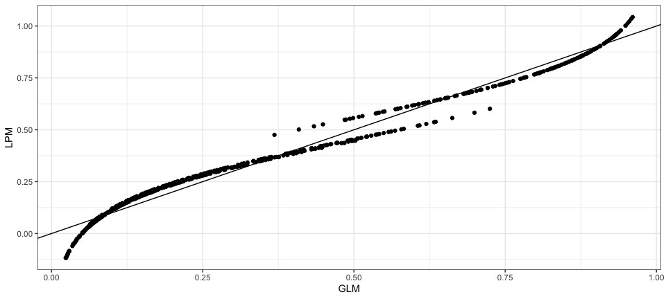<!-- -->


## Fun stuff to read

1. [Health Policy Data Science Lab's Difference-in-Differences page](https://diff.healthpolicydatascience.org/)
1. Lindner S, McConnell KJ. Difference-in-differences and matching on outcomes: a tale of two unobservables. Health Serv Outcomes Res Method. 2019;19(2-3):127-144. doi:10.1007/s10742-018-0189-0
1. Bilinski A, Hatfield LA. Nothing to see here? Non-inferiority approaches to parallel trends and other model assumptions. arXiv:180503273 [stat]. Published online January 16, 2020. Accessed April 30, 2020. http://arxiv.org/abs/1805.03273
1. Rambachan A, Roth J. An Honest Approach to Parallel Trends. Working paper. 
1. Revisiting the Difference-in-Differences Parallel Trends Assumption: Part I Pre-Trend Testing. Accessed November 13, 2020. https://blogs.worldbank.org/impactevaluations/revisiting-difference-differences-parallel-trends-assumption-part-i-pre-trend

## More fun stuff to read


1. Revisiting the Difference-in-Differences Parallel Trends Assumption: Part II What happens if the parallel trends assumption is (might be) violated? Accessed November 13, 2020. https://blogs.worldbank.org/impactevaluations/revisiting-difference-differences-parallel-trends-assumption-part-ii-what-happens
1. Horrace WC, Oaxaca RL. Results on the bias and inconsistency of ordinary least squares for the linear probability model. Economics Letters. 2006;90(3):321-327. doi:10.1016/j.econlet.2005.08.024
1. Whether to probit or to probe it: in defense of the Linear Probability Model. Accessed November 13, 2020. https://blogs.worldbank.org/impactevaluations/whether-to-probit-or-to-probe-it-in-defense-of-the-linear-probability-model


.
